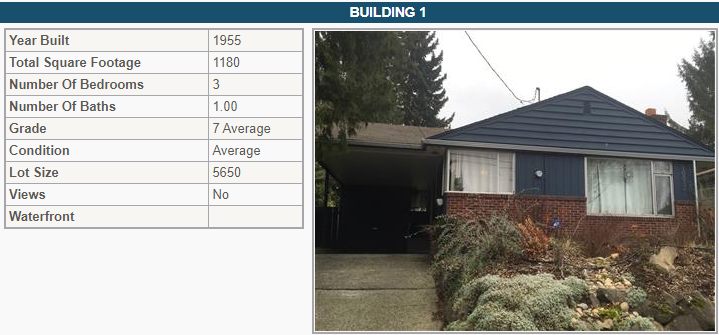
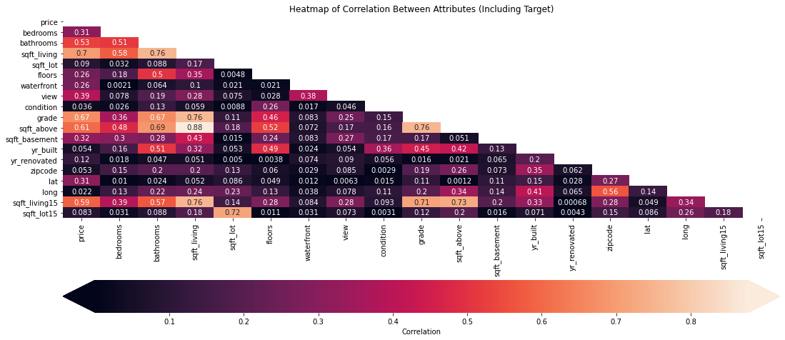
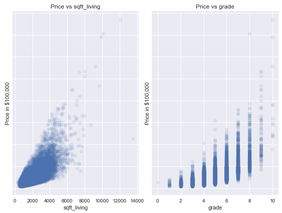
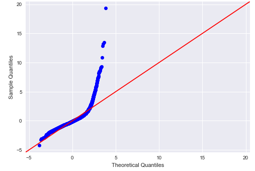
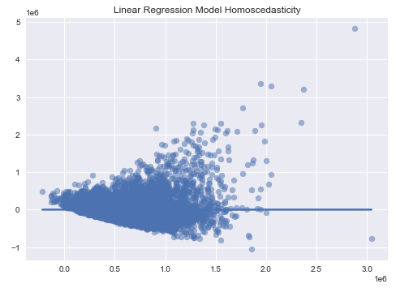
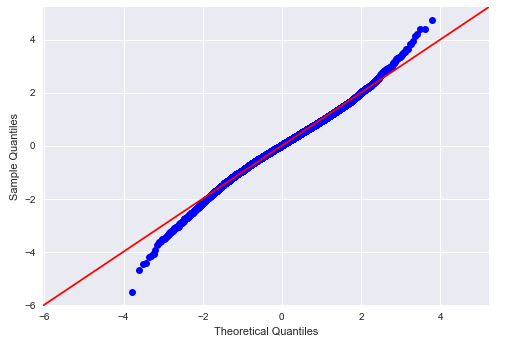
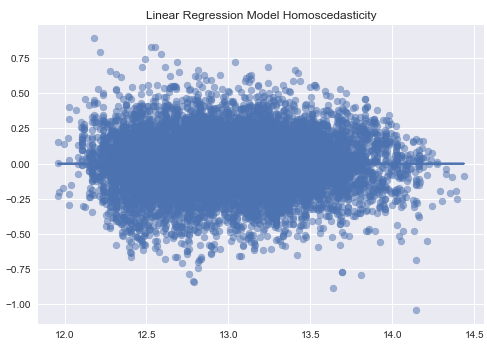
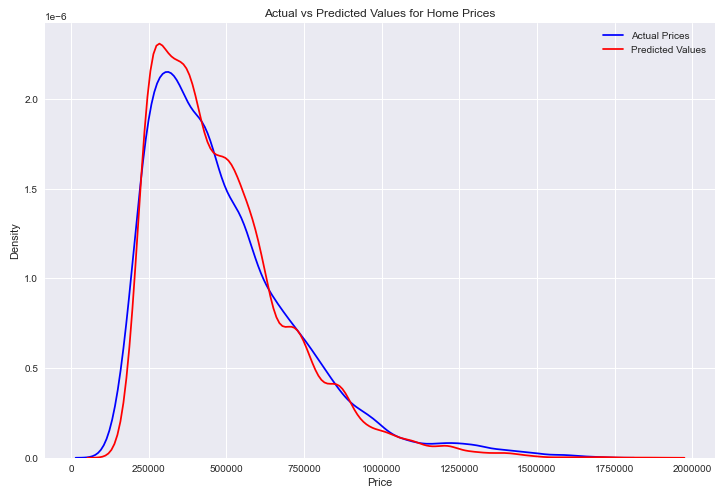

# Using Multiple Linear Regression to Predict Prices of Homes in King County, WA

## Project Overview

The goal of this project is to utilize existing data from the King's County housing set from 2014-2015 to predict prices of homes in the area. This dataset represents homes sold in this date range and it includes many different variables.

### Business Problem

The stakeholder is a real estate agency that wants to establish its group in the King's County area. Their aim is to find which characteristics create value in homes. The agency will then invest in homes with these characteristics.

### The Data

This project uses the King County House Sales dataset, which can be found in  `kc_house_data.csv` in the data folder in this assignment's GitHub repository. The description of the column names can be found in `column_names.md` in the same folder. 

The dataset has about 21,600 different homes and includes variables such as sale price, number of bedrooms and bathrooms, squarefootage, zipcode, condition, and several others.

This dataset has been compiled from the King County Department of Assesments: https://kingcounty.gov/depts/assessor.aspx

One example of some of the information included in the Assessor tool provided by King County:

### Methods

First, the data will be cleaned to handle null-values and to handle datatypes. Specifically, 'object' datatypes will be treated in some way to allow for histograms, scatterplots, etc. 

Variables will be examined to evaluate correlation with the target variable, 'price'. Then, variables will be chosen to build a linear regression model with the target variable of price. 

A correlation map is shown below between all the variables in the dataset and price.

Iterative models will be used to find a multiple linear regression model that satisfies requirements for a linear regression model and provides useful insights.

### Baseline Model

The two highest correlative variables with price are grade and sqft_living, so these variables were chosen to build the first linear regression model. Visualizing the dependent variables with the target variable (price):

The model resulted in an r-squared value of about 54%. The model did not satisfy required regression assumptions, as seen in these visualizations:

QQPlot:

Homoscedasticity:

### Modeling Process

1. Feature engineering: combining features such as home squarefootage with lot squarefootage to create a total squarefeet category. 
2. Data processing and filtering: drop irrelevant columns, filter variables based on standard deviation or IQR, and drop variables that correlate too highly with other variables.
3. Variable transformations: use transformations such as log-normalization and dummy-variables when appropriate to do so.
4. Create linear regression model and check assumptions.
5. Post-model feature selection: drop variables with high p-value (>.05), and drop variables with the variance inflaction factor method.
6. Repeat steps as needed.

### Final Model

After attending to the modeling process described above, the variables in the final model include: zipcode, waterfront, view, condition, grade, and an engineered variable detailing how old or new the home is based on both year built and whether any major renovations have been made.

Overview of model performance:

QQPlot:

Homoscedasticity:

This model resulted in a mean absolute error of about $70,070 indicating that the model will typically result in an error around this amount. The r-squared value was 83.6%.

The final model error can be visualized below:

### Conclusions

1. Location matters! Some zip codes had a much greater impact on the model's results in comparison to others. Zip code 98039 (Medina) had the greatest impact in comparison to the rest of the zip codes.
2. In general, homes with a better view rating (a value assigned to the quality of the home's view) commanded a higher sales price; however, view 1 and view 2 performed almost the same.
3. Old vs. new homes: homes that were very new tended to reflect higher property value that any other homes and homes that were very old tended to also command a high value in comparison to the middle categories. 
4. Very high home grades had a very significant positive effect on the value of the home. Grade is a category that describes the types of materials used and the quality of workmanship.
5. The presence of a waterfront increased the sale price by about 26% in comparison to homes that do not have a waterfront.

### Future work and other recommendations:
1. Adding in GIS data such as the location of value-adding or value-negating properties such as high quality schools, hospitals, prisons, museums, etc. will allow for more qualitative data.
2. Incorporating data about the demography of the people living in an area such as median salary and typical education attainment.
3. Evaluating job opportunities in zipcodes. For example, there may be many tech companies moving to a particular area, which would increase the property values in those areas.
4. Discovering the type of sale of a home. For instance, homes that have foreclosed often go for below-market price and homes that are sold to family members often go for below-market price.